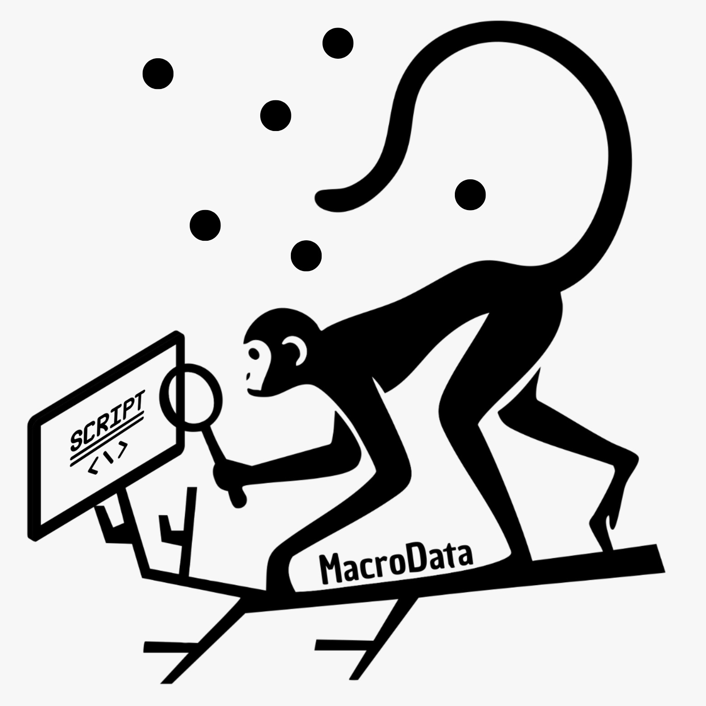

# Descipción general

Este proyecto está liderado por el Dr. Cristian Román-Palacios, ecólogo y biólogo evolutivo, actualmente Profesor Asistente en la Universidad de Arizona. Además, es miembro del Center for Diverse Leadership in Science de la Universidad de California en Los Ángeles, donde realiza actividades de extensión con comunidades locales en el área de Los Ángeles. Su trabajo combina investigación en biología evolutiva, conservación y ciencia de datos, con un interés particular en desarrollar herramientas bioinformáticas para entender mejor la diversidad biológica. A lo largo de su carrera, ha publicado más de 30 artículos científicos y ha creado paquetes en R que son usados por investigadores de todo el mundo. 
El proyecto cuenta también con la participación de Katherine Pérez- Castillo, bióloga colombiana con experiencia en investigación y trabajo de campo, con énfasis en análisis de biodiversidad particularmente en aves y ecología animal, asi como en trabajo comunitario y educacion ambiental. Katherine ha estado involucrada en iniciativas de conservación y tiene habilidades técnicas en análisis de datos ecológicos usando R. Su conocimiento del contexto colombiano y sus conexiones locales son clave para el desarrollo y la implementación de este proyecto.

# Equipo MacroData

###   
**Nombre completo**  
**Rol:** Coordinación general y contenido académico  
🌎 [Sitio web personal](#) · 🐦 [BlueSky](#) · 💼 [LinkedIn](#)  

(Descripcion)

**Intereses:**  
`#R` `#filogenia` `#cienciaabierta` `#macroevolución`

---

###   
**Nombre completo**  
**Rol:** Logística, apoyo institucional y comunicación  
🌎 [Sitio web personal](#) · 🐦 [BlueSky](#) · 💼 [LinkedIn](#)  

(Descripcion)

**Intereses:**  
`#educación` `#diversidad` `#redesregionales` `#gestióncientífica`

---

###   
**Nombre completo**  
**Rol:** Desarrollo de recursos y acompañamiento técnico  
🌎 [Sitio web personal](#) · 🐦 [BlueSky](#) · 💼 [LinkedIn](#)  

(Descripcion)

**Intereses:**  
`#programación` `#Rstats` `#recursosabiertos` `#pedagogía`

